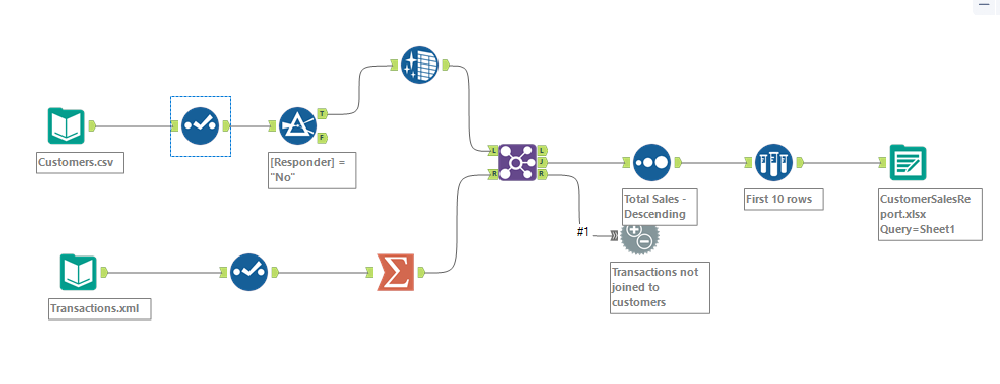

# Customer-Segmentation-and-Sales-Reporting-Automation

# 🧩 Customer Segmentation and Sales Reporting Automation (Alteryx Designer)

This project demonstrates how to build an end-to-end data automation workflow using **Alteryx Designer**. The goal was to automate a customer sales reporting process that typically took ~60 minutes per week, and reduce it to under a second using a low-code ETL pipeline.

---

## 📌 Project Overview

We leveraged Alteryx Designer to:
- Ingest and cleanse customer and transaction datasets
- Join the datasets based on Customer ID
- Summarize total sales and order counts per customer
- Segment the top 10 customers by spending across four customer segments
- Output a dynamic Excel report with separate sheets for each segment

---

## 📁 Folder Structure

```
Customer-Sales-Reporting-Automation-Alteryx/
├── data/
│   ├── customer.csv
│   └── transactions.xml
├── outputs/
│   └── customer_sales_report.xlsx
├── images/
│   └── workflow_screenshot.png
├── Customer_Sales_Report_Workflow.yxmd
└── README.md
```

## 🚀 Tools & Technologies

- **Alteryx Designer** (No-code/low-code ETL platform)
- Input Data: `CSV` and `XML`
- Output: Multi-sheet `Excel` report
- Alteryx Tools Used: Input Data, Select, Filter, Join, Summarize, Sort, Sample, Output Data, Data Cleansing, Browse, Test

---

## 📊 Key Metrics

- ✅ Reduced reporting time from **60 minutes** to **<1 second**
- ✅ Processed **2,600+ customer records** and **2,700+ transactions**
- ✅ Automated report generation with **top 10 customers** per **4 customer segments**

---

## 🔍 Workflow Preview



---

## 📤 Output Preview

The output is an Excel file with four separate worksheets:
- Each worksheet represents a customer segment
- Contains top 10 customers ranked by total sales
- Includes customer name, number of orders, and total spend

---

## 📌 How to Run

1. **Install Alteryx Designer** (Free 30-day trial available at [Alteryx website](https://www.alteryx.com))
2. Download or clone this repository
3. Open `Customer_Sales_Report_Workflow.yxmd` in Alteryx Designer
4. Ensure input file paths (`data/customer.csv`, `data/transactions.xml`) are correctly linked
5. Click **Run** or press `Ctrl + R` to execute the workflow

---

## 💡 Lessons Learned

- Gained hands-on experience with Alteryx Designer's core tools
- Learned best practices for data profiling, joining, cleansing, and workflow validation
- Improved understanding of automating repetitive business intelligence tasks

---

## 📞 Contact

Created by **Aneesh Krishna**  
Feel free to connect with me on [LinkedIn](https://www.linkedin.com/in/aneesh-krishna/) or reach out via email for collaboration!

---
